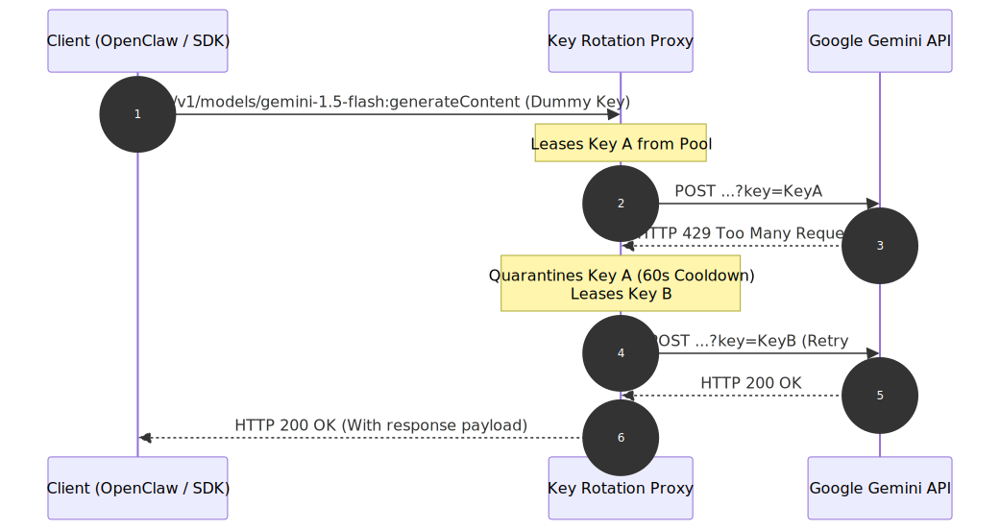

# Gemini API Key Rotator

A production-ready, lightweight reverse proxy written in Node.js and TypeScript. It intercepts incoming API calls, rotates sequentially through a pool of Google Gemini API keys using a round-robin strategy, isolates exhausted keys (`429 Too Many Requests`) with a 60-second cooldown window, and transparently retries requests within the same HTTP lifecycle.


---


## Request Lifecycle & Flow

### Key Rotation & Retry Flowcharts
These diagrams outline how the proxy leases keys and manages forwarding/retry states:

#### 1. Key Selection & Cooldown Management


#### 2. Request Forwarding & Retry Loop


### System Architecture Sequence
Shows how the client, proxy, and Google Gemini API interact during a rate limit retry event:




---


## Features

* **Strict Round-Robin Sequential Rotation**: Switches keys on *every single request* to balance load.
* **Smart Cooldown Interceptor**: Quarantines failed or rate-limited keys for 60,000ms and immediately tries the next key in the same lifecycle.
* **Monitoring Status Dashboard**: Securely monitors keys' active cooldowns, timestamps, and error metrics at `/status` (keys are safely masked).
* **Render Keep-Alive Pinger**: An internal self-ping mechanism that hits its own public URL to prevent free-tier servers from sleeping.
* **Docker Ready**: Features a multi-stage production build structure for optimized and secure container deployments.


---


## Project Structure

```text
c:\projects\rotator\
├── src/
│   ├── index.ts          # Express proxy server & retry logic
│   └── KeyManager.ts     # Rotation & cooldown state manager
├── Dockerfile            # Multi-stage production container config
├── .dockerignore         # Container build file exclusions
├── .env.example          # Environment variables template
├── .gitignore            # Git exclusion rules
├── package.json          # Dependencies & npm scripts
├── tsconfig.json         # TypeScript configurations
├── README.md             # Project documentation & flowcharts
└── main.py               # Local verification python script
```


---


## Getting Started

### Prerequisites
- Node.js (v18 or higher)
- npm

### 1. Installation
Clone the repository and install the development dependencies:
```bash
npm install
```

### 2. Configuration
Create a `.env` file in the root workspace directory:
```env
PORT=3000

# Comma-separated list of your Gemini API keys
GEMINI_API_KEYS=AIzaSyA_key1,AIzaSyB_key2,AIzaSyC_key3

# (Optional) Public domain URL to keep the Render free tier awake
PUBLIC_URL=https://your-service-name.onrender.com
```

### 3. Run Locally
* **Development mode** (runs via `ts-node-dev` with hot reload):
  ```bash
  npm run dev
  ```
* **Production mode** (builds TypeScript and launches build output):
  ```bash
  npm run build
  npm start
  ```


---


## Docker Deployment

The proxy is containerized using a secure, optimized multi-stage build:

```bash
# Build the production Docker image
docker build -t gemini-rotator .

# Spin up the container on port 3000
docker run -d -p 3000:3000 --env-file .env gemini-rotator
```


---


## Deploying on Render (Free Tier Keep-Alive)

1. Create a new **Web Service** on [Render](https://dashboard.render.com).
2. Connect your GitHub repository.
3. Configure the following runtime options:
   * **Runtime**: `Docker` (automatically detects the [Dockerfile](file:///c:/projects/rotator/Dockerfile))
   * **Instance Type**: `Free`
4. Add the following **Environment Variables**:
   * `GEMINI_API_KEYS` = `your_comma_separated_keys`
   * `PORT` = `3000`
   * `PUBLIC_URL` = `https://your-app-name.onrender.com` (use your actual Render subdomain URL)

> [!TIP]
> The internal pinger will make a request to `${PUBLIC_URL}/status` every 10 minutes. Since this goes through Render's external load balancers, it resets the 15-minute sleep countdown, maintaining 100% server uptime!


---


## Integrating the Proxy with Other Codebases

To target this proxy in any other script or tool (like OpenClaw or custom frontends), point the application's **Base API URL** to your proxy and supply **any dummy key** (the proxy overrides it automatically).

### Python Example (`google-generativeai`)
```python
import google.generativeai as genai

# Route request through the proxy
genai.configure(
    api_key="DUMMY_API_KEY",
    client_options={"api_endpoint": "https://your-proxy-domain.onrender.com"}
)

model = genai.GenerativeModel('gemini-1.5-flash')
response = model.generate_content("Write a haiku about load balancing.")
print(response.text)
```

### Node.js Example (`@google/generative-ai`)
```javascript
const { GoogleGenAI } = require("@google/generative-ai");

const ai = new GoogleGenAI({
  apiKey: "DUMMY_API_KEY",
  baseUrl: "https://your-proxy-domain.onrender.com"
});

async function run() {
  const model = ai.getGenerativeModel({ model: "gemini-1.5-flash" });
  const result = await model.generateContent("Explain API scaling.");
  console.log(result.response.text);
}
run();
```

### Raw HTTP Requests (cURL)
```bash
curl -X POST "https://your-proxy-domain.onrender.com/v1beta/models/gemini-1.5-flash:generateContent?key=DUMMY_KEY" \
     -H "Content-Type: application/json" \
     -d '{"contents": [{"parts":[{"text": "Hi!"}]}]}'
```


---


## Contributing

Contributions are welcome! Please feel free to submit a Pull Request.

1. Fork the Project
2. Create your Feature Branch (`git checkout -b feature/AmazingFeature`)
3. Commit your Changes (`git commit -m 'Add some AmazingFeature'`)
4. Push to the Branch (`git push origin feature/AmazingFeature`)
5. Open a Pull Request


---


## Contact

For questions, issues, or feature requests, please open an issue in this repository:

GitHub Repository: [Atulya-Juyal/gemini-api-key-rotator](https://github.com/Atulya-Juyal/gemini-api-key-rotator)
